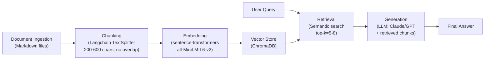

# Project 1 Planning: The Unofficial Guide

> Write this document before you write any pipeline code.
> Your spec and architecture diagram are what you'll use to direct AI tools (Claude, Copilot, etc.) to generate your implementation — the more specific they are, the more useful the generated code will be.
> Update the Retrieval Approach and Chunking Strategy sections if you change your approach during implementation.
> Update this file before starting any stretch features.

---

## Domain

I focused on housing experiences in Knight Circle, one of the main student housing options for UCF. I chose this for a few reasons; namly because it has multiple phases, some older than others; a general "it's bad" review with no specifics on the phase is difficult to reason with. Secondly, many problems are neverending, so a lack of new reviews or discussion on a topic doesn't mean the problem solved, it's just not spoken of any more (the way things are). Also unless you know someone directly to ask detailed questions to, most reviews on Reddit were pretty high-level, and wouldn't be helpful to someone as a freshman, looking for their first dorm.

---

## Documents

<!-- List your specific sources: URLs, subreddit names, forum threads, or file descriptions.
     Aim for at least 10 sources that together cover different subtopics or perspectives within your domain. -->

| # | Source | Description | URL or location |
|---|--------|-------------|-----------------|
| 1 | knights_circle_general.md | 2 comprehensive reviews covering broken amenities, mold, maintenance access issues, roaches | Compiled from r/ucf threads (Nov 2023) |
| 2 | knights_circle_maintenance.md | 5 reviews focused on maintenance responsiveness, mold, water intrusion, WiFi reliability, pest control | Compiled from r/ucf threads (Jun–Aug 2022) |
| 3 | knights_circle_phases.md | 5 reviews comparing Phase 1, 2, and 3 with phase-specific details (location, shuttle availability, noise, safety) | Compiled from r/ucf threads (Jun–Aug 2022) |
| 4 | knights_circle_towing.md | 2 reviews documenting towing policies, visitor parking rules, predatory practices, costs | Compiled from r/ucf threads (Dec 2023) |

---

## Chunking Strategy

**Chunk size:** 200–600 characters per chunk (approximately 30–100 tokens)

**Overlap:** None (0 characters)

**Reasoning:**

My corpus is review-heavy, not long technical documents, which drives these choices:

- Each review is self-contained with metadata (phase, date, specific complaints). Unlike a long FAQ where key facts span paragraph boundaries, reviews don't need overlap for coherence.
- Short reviews (~200 words) fit in one chunk; longer reviews (500–800 words) are split at natural paragraph breaks. This preserves semantic meaning, when a review says "Phase 1 has water intrusion and mold," both facts stay together in one chunk.
- **How I know if it's right:** 
  - Too small (e.g., 100 chars): Chunks would split mid-sentence ("roaches in my bath[tub faucet]"), making context retrieval fail.
  - Too large (e.g., 1000+ chars): Chunks mix multiple unrelated complaints (towing + maintenance + WiFi), diluting signal for specific queries.

After creating the ingestion.py, I ran into two observations:
1. Chunk 1 had  918 characters, even though max_size was capped at 600.

In my chunking logic, I split strictly by paragraphs (\n\n), however chunk 1 is a single, massive block of text where the student didn't press enter once while ranting about maintenance. Because there was no paragraph break, the script had to ingest the whole thing to avoid truncating it mid-sentence.

this is fine, as it preserves the full context.

2. My script yielded 14 total chunks. The project guide mentions a guardrail: “If you have fewer than 50 chunks... your chunks may be too large.”

However since I have highly targeted, curated text documents rather than other alternatives, 14 high-signal chunks are perfectly fine to build and test your pipeline code. I just need to be mindful that when I query the system with a top_k=5, I'll be pulling in nearly a third of the entire database for a single answer.
---

## Retrieval Approach

**Embedding model:** `sentence-transformers/all-MiniLM-L6-v2` (384-dim, 22M params)

**Top-k:** 5–8 chunks

**Why this model:** all-MiniLM-L6-v2 is optimized for semantic search on short, opinion-based text. Student reviews use varying vocabulary for the same problem ("roaches," "bugs," "infestation"), and MiniLM captures this synonymy well. It's also fast and lightweight.

**Why top-k = 5–8:** My corpus has ~10 total reviews. Retrieving 5–8 chunks ensures the LLM sees multiple perspectives (e.g., both positive and critical Phase 3 reviews) without redundant duplication. Top-k=3 risks missing phase-specific nuance; top-k=15 wastes tokens on repetitive content.

**Production tradeoff reflection (cost unconstrained):**
If cost and latency weren't constraints, I would switch to:
- **Model:** OpenAI's `text-embedding-3-large` (3072-dim) or Cohere's `embed-english-v3.0` for superior domain accuracy and multilingual support (if expanding to international student perspectives)
- **Tradeoff:** 3–5× higher inference cost, 10–50ms latency per query, but better handling of slang, phase abbreviations ("KC," "P1," "P3"), and context length (16K vs. 128 tokens)
- **Top-k adjustment:** With richer embeddings, might reduce to top-k=3–5 since each chunk would be more semantically precise

---

## Evaluation Plan

| # | Question | Expected answer |
|---|----------|-----------------||
| 1 | What maintenance issues are reported in Phase 1 of Knights Circle? | Water intrusion (toilet overflows, pipes), non-stop mold problems, WiFi unreliability, water shutoffs, and safety/lighting concerns in parking areas. |
| 2 | Which phases of Knights Circle are described as having reliable shuttle service? | Phase 2 and Phase 3; Phase 2 noted as first stop (generally not full); Phase 3 has frequent shuttles but they're often full during peak times. |
| 3 | What should a student know about visitor parking and towing costs at Knights Circle? | Towing costs $130–150 (cash-only, amount increases the longer car is parked); towing company is in Bithlo; students must know visitor parking zones to avoid being towed; office provides visitor parking maps. |
| 4 | What are the most common complaints about general living conditions at Knights Circle across all phases? | Mold, roaches, broken amenities (fire pit, movie room), maintenance staff entering without notice, kitchen size/broken dishwashers/ovens, WiFi issues. |
| 5 | How do residents compare Phase 2 and Phase 3 in terms of noise, location, and overall quietness? | Phase 2 is quieter and furthest from Alafaya Trail (20-min walk to campus); Phase 3 is closer to Alafaya but experiences more traffic noise depending on building location; Phase 2 is better for quiet living. |

---

## Anticipated Challenges

1. **Missing phase information reduces retrieval precision:** Some reviews don't specify which phase they lived in (labeled "Phase: Unknown"). When a user queries "What's Phase 1 like?", the system might retrieve irrelevant general complaints from unknown-phase reviews, polluting results. *Mitigation:* Add metadata tags to chunks; filter by phase in post-retrieval ranking; fall back to showing both phase-specific and general complaints with clear attribution.

2. **Contradictory opinions create ambiguity:** Phase 3 is described as "the best phase" by one resident and "noisy" with "full shuttles" by another. The LLM must handle this nuance without confusing users. If retrieval returns only one perspective, the answer is biased. *Mitigation:* Ensure top-k=5–8 retrieves multiple viewpoints; instruct LLM to present trade-offs ("Phase 3 has good shuttle frequency but can be loud").

3. **Metadata sparsity (date/phase) causes off-topic retrieval:** A review mentioning "roaches" without phase info might be retrieved for a Phase 1 query even if the reviewer lived in Phase 2. The vector embedding doesn't guarantee phase accuracy. *Mitigation:* Chunk with metadata prefix ("[Phase 1, June 2022] roaches..."); use hybrid search (BM25 + semantic) to weight phase keywords heavily.

---

## Architecture

**Pipeline Breakdown:**
1. **Ingestion:** Load 4 markdown files (knights_circle_general.md, maintenance.md, phases.md, towing.md)
2. **Chunking:** Split by review boundaries (200–600 chars); preserve metadata (phase, date)
3. **Embedding:** Convert text to 384-dim vectors using all-MiniLM-L6-v2
4. **Vector Store:** Index chunks in ChromaDB for fast similarity search
5. **Retrieval:** On user query, embed query, find top-5 to 8 semantically similar chunks
6. **Generation:** Pass retrieved chunks to LLM with prompt; generate answer with citations
7. **Output:** User sees answer + chunk sources ("From Phase 1 review, June 2022")

---

## AI Tool Plan

**Milestone 3 — Ingestion and chunking:**
- **Tool:** Copilot for code generation
- **Input:** This planning.md (Chunking Strategy + Architecture sections), code template for document loader
- **Ask:** "Implement `load_and_chunk_documents()` that reads markdown files from `data/` folder, chunks each review to 200–600 chars at paragraph boundaries, and preserves metadata (phase, date, source). Return list of (text, metadata) tuples."
- **Verification:** Run on test files; visually inspect 3–5 chunks to confirm: (a) no mid-sentence splits, (b) metadata preserved, (c) chunk sizes in range

**Milestone 4 — Embedding and retrieval:**
- **Tool:** Claude for implementation
- **Input:** This planning.md (Retrieval Approach + Evaluation Plan sections), code template for ChromaDB setup
- **Ask:** "Implement `embed_and_store()` using sentence-transformers all-MiniLM-L6-v2 to embed chunks and store in ChromaDB. Then implement `retrieve_top_k(query, k=5)` to find semantically similar chunks. Return chunks + similarity scores."
- **Verification:** Run against Evaluation Plan questions; manually check if top-5 results for question #1 include Phase 1 water/mold complaints (from expected answer)

**Milestone 5 — Generation and interface:**
- **Tool:** Claude + LLM API (via Groq) for generation
- **Input:** Evaluation Plan questions, retrieval output from Milestone 4, prompt engineering guidelines
- **Ask:** "Given retrieved chunks and a user query, generate a coherent answer that (a) answers the query directly, (b) cites specific phases/dates, (c) handles contradictory opinions by presenting trade-offs. Test on all 5 Evaluation Plan questions."
- **Verification:** Compare model answers to Expected Answers in Evaluation Plan; check for (a) factual accuracy, (b) proper citations, (c) phase-specific nuance
